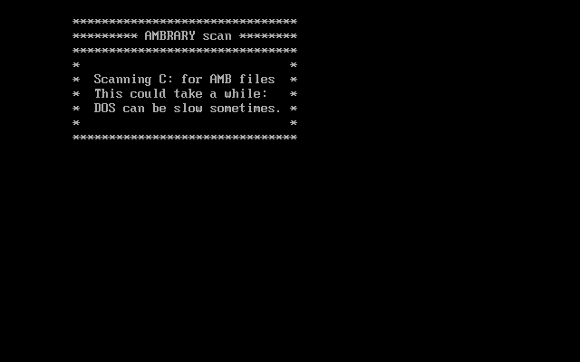
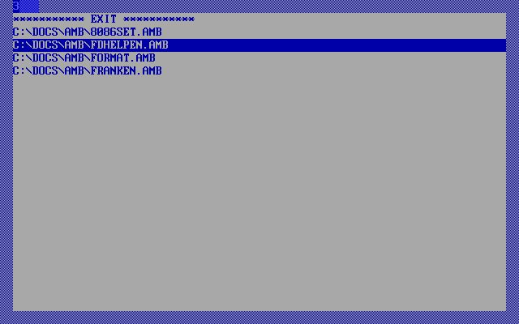
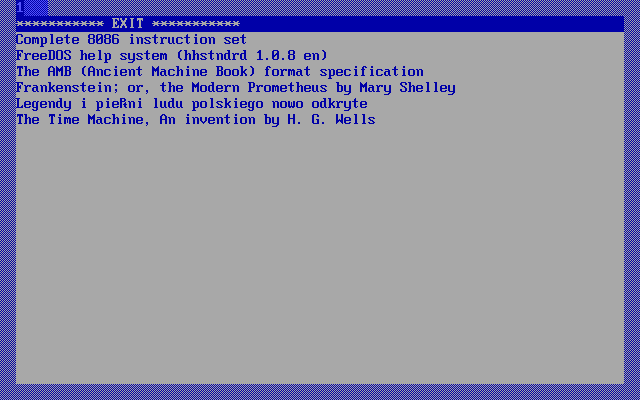

# amb-utils

Small FreeDOS utilities for Mateusz Viste's AMB ([Ancient Machine Book](http://amb.osdn.io/)) e-book format.

------------------------------------------------------

## AMBRARY
(AMB library, geddit?)  
Written in QuickBASIC 4.5 for FreeDOS 1.3 RC3, 2021. Don't bother trying it in DOSBOX or DosEMU - Their ancient version of COMMAND.COM does not have the DIR switches needed.

Ambrary is a simple launcher menu for your .AMB files. Requires the AMB reader and at least one AMB file to be installed. Well, it wouldn't be much use otherwise, would it?

The command AMBRARY, with no further parameters, will scan your C drive for AMB files

and will display up to 128 of them to read in the AMB reader program.

### Usage:

If you keep your .AMB files elsewhere, you can start Ambrary with a parameter indicating that. e.g.
~~~~
AMBRARY D:
~~~~
E: and F: will also be accepted. If you give more than one, the highest one will be used.

You can also increase the number of books listed. 
~~~~
AMBRARY 256
~~~~
Accepted values are 256, 512 and 1024. Again, the highest number given is used. If AMB ever takes off to the extent that you need more space than that, you will probably need a more sophisticated launcher program.

Parameters may be given in any order. AMBRARY D: 512 and AMBRARY 512 D: work exactly the same.

AMBRARY /D: or AMBRARY --1024 or AMBRARY -F: /256 will all work, since these traditional parameter indicators are ignored.

AMBRARY /? or AMBRARY --HELP provides onscreen help.

--------------------------------------------------------

## AMBTITLE

A helper program for AMBRARY. Written in QuickBASIC 4.5 for FreeDOS 1.3 RC3,

The command AMBTITLE, with no further parameters, will scan your C drive and extract the title of each book found. This information will be stored in a file that AMBRARY 0.2 or higher can read. AMBRARY will then display the title rather than the filename.

If you keep your .AMB files elsewhere, you can start AMBTITLE with a parameter indicating that, just like AMBRARY.

You only need to run this utility when you have added new AMB books to your collection or remove them. The whole process is a bit slow, so I have not incorporated this into AMBRARY itself.  

AMBTITLE requires DELTREE, the AMBPACK utility and at least one AMB file to be installed.

--------------------------------------------------------

## AMB e-books

The AMB directory contains a few e-books I have created in AMB format, mainly for my own purposes and so that I can get a handle on this format. Right now, I can't say how far this library will grow.

I will only include AMB files in languages I actually know, but if you'd like to see your AMB file in Tagalog, Serbo-Croation or Guarani listed here, [email them to me](mailto:clasqm@gmail.com) and we'll see what we can do.
